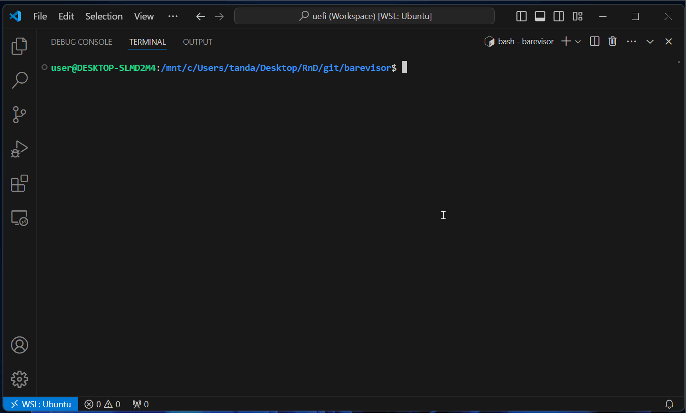

# uefi_hv

Barevisor as a UEFI driver for Intel and AMD processors.


- [uefi\_hv](#uefi_hv)
  - [Why UEFI driver-based hypervisor](#why-uefi-driver-based-hypervisor)
  - [Building](#building)
  - [Testing with Bochs](#testing-with-bochs)
    - [Setting up a VM](#setting-up-a-vm)
    - [Loading on and virtualizing UEFI](#loading-on-and-virtualizing-uefi)
  - [Testing with VMware](#testing-with-vmware)
    - [Loading on and virtualizing UEFI](#loading-on-and-virtualizing-uefi-1)


## Why UEFI driver-based hypervisor

Barevisor can be compiled into both the UEFI driver and Windows kernel driver. Those interested in virtualizing UEFI, boot loaders, and early OS initialization phases should study UEFI driver-based hypervisors. It is also suitable for having a better picture of how Intel VT-x and AMD SVM, as well as OS-agnostic designs.


## Building

1. Navigate to the `barevisor\src\uefi` directory.

    ```text
    > cd C:\Users\tanda\Desktop\RnD\GitHub\barevisor\src\uefi
    ```

2. Build Barevisor with the `xtask` command.

    ```text
    > cargo xtask build
    ```

    If successful, `target\x86_64-unknown-uefi\debug\uefi_hv.efi` should exist.

    Along with that, `check_hv_vendor.efi` is built. This is useful for confirming that Barevisor is loaded into the system (more in the below section).


## Testing with Bochs

Barevisor can be partially tested with [Bochs](https://github.com/bochs-emu/Bochs), a cross-platform open-source x86_64 PC emulator. It is **extremely** helpful in the early phase of hypervisor development as it can be used to debug the types of errors that are difficult to diagnose on VMware. Failure of the VMX instructions is the primal example.


### Setting up a VM

Set up a Bochs VM with the following instructions:

- <details markdown="block"><summary>On Ubuntu and Windows (WSL)</summary>

    ```
    $ sudo apt install build-essential p7zip-full mtools genisoimage
    $ git clone -b barevisor https://github.com/tandasat/Bochs.git
    $ cd Bochs/bochs
    $ sh .conf.linux
    $ make
    $ sudo make install
    ```

    </details>

- <details markdown="block"><summary>On macOS</summary>

    ```
    $ brew install p7zip
    $ brew install mtools
    $ brew install cdrtools
    $ git clone -b barevisor https://github.com/tandasat/Bochs.git
    $ cd Bochs/bochs
    $ sh .conf.macosx
    $ make
    $ sudo make install
    ```

    </details>

### Loading on and virtualizing UEFI

In the `uefi` directory, run either `cargo xtask bochs-amd` or `cargo xtask bochs-intel` to test on AMD and Intel processors respectively.



Note that the author was unable to test booting an OS in Bochs because unable to install an OS in our Bochs configuration, where UEFI is used instead of traditional BIOS. Please let me know if you made it work.


## Testing with VMware

You can use VMware Workstation Pro or Fusion Pro to test the hypervisor with a VM comes with this repo.


### Loading on and virtualizing UEFI

1. Install the necessary dependencies:

   - On Ubuntu and Windows (WSL)

       ```
       $ sudo apt install build-essential p7zip-full mtools genisoimage
       ```

   - On macOS

       ```
       $ brew install p7zip
       $ brew install mtools
       $ brew install cdrtools
       ```

2. In the `uefi` directory, run `cargo xtask vmware`.

3. One the VM started, select the "EFI Internal Shell (Unsupported option)" boot option.

4. It will automatically load `uefi_hv.efi` as below:

    ```text
    startup.nsh> echo -off
    Loading uefi_hv.efi
    Image base: 0xe5ce000..0xe627000
    Loaded uefi_hv.efi
    load: Image fs1:\uefi_hv.efi loaded at E5CE000 - Success
    Executing CPUID(0x40000000) on all logical processors
    CPU 0: Barevisor!
    fs1:\>
    ```

    ✅ If successful, serial output should appear. Additionally, you may confirm that Barevisor is active by executing `check_hv_vendor.efi`.

    ```text
    fs1:\> check_hv_vendor.efi
    Executing CPUID(0x40000000) on all logical processors
    CPU 0: Barevisor!
    ```

You will want to boot an OS after installing Barevisor. Install your choice of a Windows version for testing in the provided VM image.
