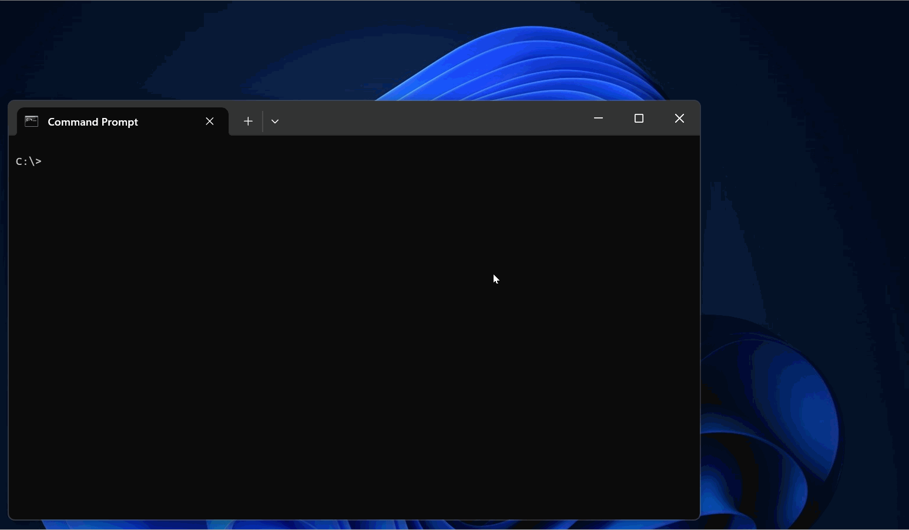

# uefi_hv

Barevisor as a UEFI driver for Intel and AMD processors.




## Why UEFI driver-based hypervisor

Barevisor can be compiled into both UEFI driver and Windows kernel driver. Those who are interested in virtualizing UEFI, boot loaders and early OS initialization phases should study UEFI driver-based hypervisors. It is also suitable for having a better picture of how Intel VT-x and AMD SVM, and OS agnostic designs.


## Building

1. Navigate to the `barevisor\src\uefi` directory.

    ```text
    > cd C:\Users\tanda\Desktop\RnD\GitHub\barevisor\src\uefi
    ```

2. Build Barevisor with the `xtask` command.

    ```text
    > cargo xtask build
    ```

    If successful, `target\x86_64-unknown-uefi\debug\uefi_hv.efi` should exist.

    Along with that, `check_hv_vendor.efi` is built. This is useful for confirming that Barevisor is loaded into the system (more in the below section).


## Loading in a VMware VM

1. Disable secure boot on the target system. It requires a change in BIOS settings, and actual steps vary depending on models.

2. Boot the system into UEFI shell.

3. Copy `uefi_hv.efi` into external storage and connect it to the VM.

4. Load Barevisor.

    ```text
    Shell> fs1:
    fs1:\> load uefi_hv.efi
    Loading uefi_hv.efi
    Image base: 0xe374000..0xe3c2000
    Loaded uefi_hv.efi
    load: Image fs1:uefi_hv.efi loaded at E374000 - Success
    ```

    If successful, serial output should appear. Additionally, you may confirm that Barevisor is active by executing `check_hv_vendor.exe`.

    ```text
    fs1:\> check_hv_vendor.efi
    Executing CPUID(0x40000000) on all logical processors
    CPU 0: Barevisor!
    CPU 1: Barevisor!
    CPU 2: Barevisor!
    CPU 3: Barevisor!
    ```
