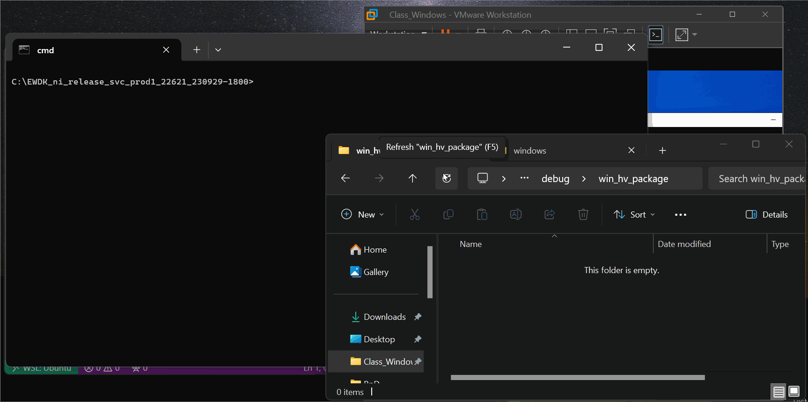

# win_hv

Barevisor as a Windows kernel driver for Intel and AMD processors.




## Why kernel driver-based hypervisor

Barevisor can be compiled into both UEFI driver and Windows kernel driver. Those familiar with Windows kernel module development should consider the kernel driver-based hypervisor as most approachable because the hypervisor requires less code and can be debugged with the traditional kernel-debugger, Windbg.


## Building

⚠️Building Barevisor as a Windows kernel-driver requires Windows as a development environment, due to dependencies onto Enterprise WDK (eWDK).

1. Download [eWDK](https://learn.microsoft.com/en-us/legal/windows/hardware/enterprise-wdk-license-2022).

2. Mount or extract the contents of the downloaded ISO file.

3. Double click on `LaunchBuildEnv.cmd` in the top directory of the ISO file. It should start up the command prompt.

    ```text
    **********************************************************************
    ** Enterprise Windows Driver Kit (WDK) build environment
    ** Version ni_release_svc_prod1.22621.2428
    **********************************************************************
    ** Visual Studio 2022 Developer Command Prompt vError: Unknown error
    ** Copyright (c) 2022 Microsoft Corporation
    **********************************************************************
    C:\EWDK_ni_release_svc_prod1_22621_230929-1800>
    ```

4. Navigate to the `barevisor\src\windows` directory.

    ```text
    > cd C:\Users\tanda\Desktop\RnD\GitHub\barevisor\src\windows
    ```

5. Install `cargo-make`.

    ```text
    > cargo install cargo-make
    ```

6. Build Barevisor.

    ```text
    > cargo make
    ```

    ⚠️ If you encounter an error like this, turn on the Developer Mode through Settings > System > For developers > Developer Mode.

    ```log
    [cargo-make] INFO - Execute Command: "rust-script" "target\\_cargo_make_temp\\persisted_scripts\\D4060E7434B3779E78A683E8BA00D06A5D08BE8C95BC432359E22F06CB30EF1C.rs"
    Error: IoError(Os { code: 1314, kind: Uncategorized, message: "A required privilege is not held by the client." })
    [cargo-make] ERROR - Unable to execute rust code.
    [cargo-make] WARN - Build Failed.
    ```

    ✅ If successful, `target\debug\win_hv_package\win_hv.sys` should exist.

7. Optionally, build the `check_hv_vendor` package. This is useful for confirming that Barevisor is loaded into the system (more in the below section).

    ```text
    > cargo build
    ```


## Setting up a VMware VM

1. Install Windows 10 or 11 of any edition. Installation of VMware Tools is optional.

2. Open "Virtual Machine Settings", then:
   - In the "Hardware" tab,
     - Select "Processors" and check "Virtualize Intel VT-x/EPT or AMD-V/RVI".
     - Delete a "Printer Port" if present. This is required to view serial output from a VMware VM.
     - Add a "Serial Port" and make sure:
       - "Connect at power on" is checked
       - "Use output file:" is selected
   - In the "Options" tab,
     - Select "Advanced" and uncheck "Enable secure boot".

3. Boot the VM, and start the command prompt with Administrators privileges, then,
   - Enable test signing.

       ```text
       > bcdedit /set testsigning on
       ```

   - Disable the serial service. This is required to view serial output from Barevisor.

       ```text
       > sc config serial start=disabled
       ```

4. Disable Hyper-V:
   - Turn off
       - Settings > Privacy & security > Windows Security > Device security > Core isolation details > Memory integrity

   - On an elevated command prompt, run
       ```
       > bcdedit /set hypervisorlaunchtype off
       ```

   - Reboot.

        If Hyper-V is fully disabled, `msinfo32.exe` shows compatibility with hypervisors as below.

        


## Loading on and virtualizing a Windows

1. Copy `win_hv.sys` onto the target Windows, for example, `C:\win_hv.sys`.

2. Start the command prompt with Administrators privileges.

3. Create a service for Barevisor.

    ```text
    > sc create hv type= kernel binPath= C:\win_hv.sys
    ```

4. Start Barevisor.

    ```text
    > sc start hv

    SERVICE_NAME: hv
            TYPE               : 1  KERNEL_DRIVER
            STATE              : 4  RUNNING
                                    (STOPPABLE, NOT_PAUSABLE, IGNORES_SHUTDOWN)
            WIN32_EXIT_CODE    : 0  (0x0)
            SERVICE_EXIT_CODE  : 0  (0x0)
            CHECKPOINT         : 0x0
            WAIT_HINT          : 0x0
            PID                : 0
            FLAGS              :
    ```

    If successful, serial output should appear. Additionally, you may confirm that Barevisor is active by executing `check_hv_vendor.exe`.

    ```text
    > check_hv_vendor.exe
    Executing CPUID(0x40000000) on all logical processors
    CPU 0: Barevisor!
    CPU 1: Barevisor!
    CPU 2: Barevisor!
    CPU 3: Barevisor!
    ```
